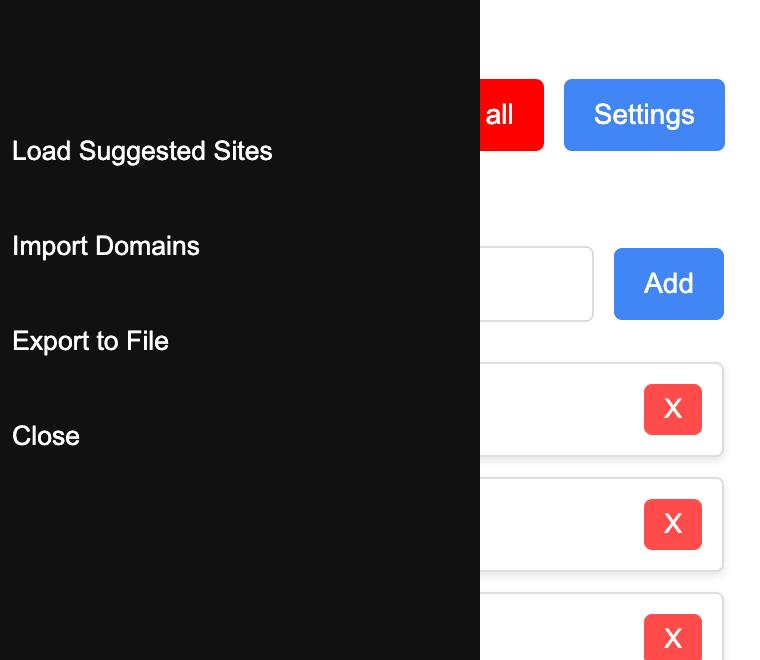

# TypoProtect Extension v2.0

Protección avanzada contra phishing, typosquatting y ataques homógrafos con base de datos actualizada automáticamente. Compatible con Chrome (Manifest V3) y Firefox (Manifest V2).

## ✨ Características Principales

### 🛡️ Protección Multi-Nivel
- **Base de datos de phishing**: Integración con OpenPhish para bloquear dominios maliciosos conocidos
- **Detección de typosquatting**: Identifica dominios similares a tus sitios de confianza
- **Detección de homóglifos**: Reconoce caracteres Unicode sospechosos y ataques IDN/punycode
- **Actualización automática**: Base de datos actualizada cada 24 horas automáticamente

### 🎨 Interfaz Moderna
- **Diseño minimalista**: UI completamente rediseñada con estilo moderno y oscuro
- **Dashboard de protección**: Visualiza el estado de protección y cantidad de dominios bloqueados
- **Notificaciones toast**: Feedback visual claro para todas las acciones
- **Animaciones suaves**: Transiciones y animaciones fluidas para mejor UX

### ⚡ Rendimiento Optimizado
- **Bloom Filter**: Búsquedas ultrarrápidas con mínima huella de memoria
- **Funcionamiento offline**: Lista inicial empaquetada para protección sin conexión
- **Almacenamiento eficiente**: Optimizado para manejar grandes bases de datos

## 🏗️ Arquitectura

La extensión consta de tres componentes principales:

### Background Script ([src/background/background.js](src/background/background.js))
- **Bloom Filter**: Implementación nativa para búsquedas O(1) en base de datos de phishing
- **Fetch automático**: Descarga y actualiza lista de OpenPhish cada 24h
- **Detección multinivel**: 
  1. Verificación contra blacklist (prioridad máxima)
  2. Detección de homóglifos Unicode/punycode
  3. Análisis de typosquatting vs dominios de confianza
- **Gestión de alarmas**: Sistema de actualización periódica con `chrome.alarms`

### Popup ([src/popup/](src/popup/))
- **Dashboard de protección**: Muestra dominios bloqueados y última actualización
- **Gestión de dominios**: Añadir/eliminar dominios de confianza
- **Actualización manual**: Botón para forzar actualización de base de datos
- **Importar/Exportar**: Funcionalidad de backup de listas personalizadas

### Content Script ([src/content/content.js](src/content/content.js))
- **Banner de advertencia**: Notificación moderna con animación slideDown
- **Mensajes contextuales**: Muestra razón específica del bloqueo
- **Botón de cierre**: Permite cerrar temporalmente la advertencia

## 📦 Instalación

### Chrome / Edge / Brave

#### Desde Chrome Web Store:
Sigue este [link](https://chromewebstore.google.com/detail/typosquatting-protection/ofhhhkhomfdapknngpeefhpipfcgmkee?hl=es) y presiona "Instalar"

#### Instalación manual (desarrollo):
1. Descarga o clona este repositorio
2. Abre `chrome://extensions/` en tu navegador
3. Activa "Modo de desarrollador" (esquina superior derecha)
4. Click en "Cargar extensión sin empaquetar"
5. Selecciona la carpeta `manifest_chrome`

### Firefox

#### Instalación manual (desarrollo):
1. Descarga o clona este repositorio
2. Abre `about:debugging#/runtime/this-firefox`
3. Click en "Cargar complemento temporal"
4. Navega a `manifest_firefox/` y selecciona `manifest.json`

## 🚀 Uso

1. **Primera vez**: La extensión descargará automáticamente la base de datos de phishing de OpenPhish
2. **Añadir sitios de confianza**: Click en el icono de la extensión y añade dominios que quieras proteger contra typosquatting
3. **Actualización manual**: Click en el botón ↻ en el dashboard para actualizar la base de datos
4. **Navegación protegida**: La extensión trabajará en segundo plano bloqueando amenazas automáticamente

## 🔄 Actualizaciones

- **Automáticas**: La base de datos se actualiza cada 24 horas automáticamente
- **Manual**: Usa el botón de actualización en el popup para forzar una actualización inmediata
- **Fuente de datos**: [OpenPhish Community Feed](https://openphish.com/phishing_feeds.html) (actualizado cada 12 horas)

## 🛠️ Tecnologías Utilizadas

- **Bloom Filter**: Implementación nativa en JavaScript para búsquedas probabilísticas eficientes
- **Chrome Extensions API**: Manifest V3 (Chrome) y V2 (Firefox)
- **OpenPhish API**: Feed comunitario gratuito de URLs de phishing
- **Modern CSS**: Glassmorphism, backdrop-filter, animaciones CSS3
- **Local Storage**: `chrome.storage.local` para bases de datos grandes

## 📊 Capturas de Pantalla

### Versión Anterior (v1.x)

### Nueva Versión (v2.0)
_Capturas de pantalla actualizadas próximamente_

## 🤝 Contribuir

¡Las contribuciones son bienvenidas! Si encuentras un bug o tienes una sugerencia:

1. Fork el repositorio
2. Crea una rama para tu feature (`git checkout -b feature/AmazingFeature`)
3. Commit tus cambios (`git commit -m 'Add some AmazingFeature'`)
4. Push a la rama (`git push origin feature/AmazingFeature`)
5. Abre un Pull Request

## 📝 Changelog

### v2.0.0 (Noviembre 2025)
- ✨ **Nueva**: Integración con OpenPhish para bloqueo de dominios maliciosos reales
- ✨ **Nueva**: Detección de homóglifos y ataques IDN/punycode
- ✨ **Nueva**: Sistema de actualización automática diaria
- ✨ **Nueva**: Bloom Filter para búsquedas ultrarrápidas
- 🎨 **Mejorada**: UI completamente rediseñada con diseño minimalista moderno
- 🎨 **Mejorada**: Banner de advertencia con animaciones y mejor UX
- ⚡ **Mejorada**: Detección multinivel (blacklist + typosquatting + homóglifos)
- 🔧 **Mejorada**: Sistema de notificaciones toast para feedback del usuario

### v1.1.x (Anterior)
- Detección básica de typosquatting
- Gestión de dominios de confianza
- UI básica

## 📄 Licencia

Este proyecto está licenciado bajo la Licencia MIT - ver el archivo [LICENSE.md](LICENSE.md) para más detalles.

## 🙏 Agradecimientos

- [OpenPhish](https://openphish.com/) por proporcionar el feed comunitario gratuito
- Comunidad de seguridad por reportar sitios de phishing

---

**Desarrollado con ❤️ para hacer Internet más seguro**