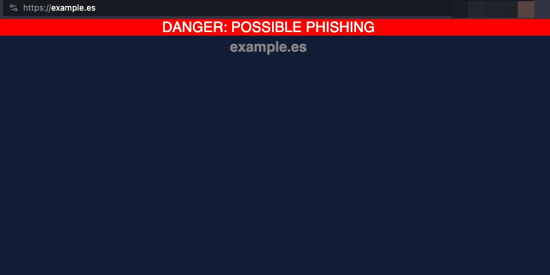

# TypoProtect Extension v2.0

TypoProtect is an advanced browser security extension that protects you from phishing attacks, typosquatting, domain spoofing, and homograph attacks. Featuring real-time malicious domain blocking with daily updated threat database from OpenPhish, multi-level detection (blacklist, homoglyph, and typosquatting analysis), and ultra-fast Bloom Filter technology. Compatible with Chrome, Edge, Brave (Manifest V3) and Firefox (Manifest V2).

**Protect your browsing with automatic threat detection, customizable trusted domain lists, and instant security alerts. Free, open-source, and privacy-focused.**

## Key Features

### Multi-Level Protection
- **Phishing database**: Integration with OpenPhish to block known malicious domains
- **Typosquatting detection**: Identifies domains similar to your trusted sites
- **Homoglyph detection**: Recognizes suspicious Unicode characters and IDN/punycode attacks
- **Automatic updates**: Database updated every 24 hours automatically

### Modern Interface
- **Minimalist design**: Completely redesigned UI with modern dark style
- **Protection dashboard**: Displays protection status and number of blocked domains
- **Toast notifications**: Clear visual feedback for all actions
- **Smooth animations**: Fluid transitions and animations for better UX

### Optimized Performance
- **Bloom Filter**: Ultra-fast searches with minimal memory footprint
- **Offline operation**: Initial list bundled for protection without connection
- **Efficient storage**: Optimized to handle large databases

## Architecture

La extensión consta de tres componentes principales:

### Background Script ([src/background/background.js](src/background/background.js))
- **Bloom Filter**: Implementación nativa para búsquedas O(1) en base de datos de phishing
- **Fetch automático**: Descarga y actualiza lista de OpenPhish cada 24h
- **Detección multinivel**: 
  1. Verificación contra blacklist (prioridad máxima)
  2. Detección de homóglifos Unicode/punycode
  3. Análisis de typosquatting vs dominios de confianza
- **Gestión de alarmas**: Sistema de actualización periódica con `chrome.alarms`

### Popup ([src/popup/](src/popup/))
- **Dashboard de protección**: Muestra dominios bloqueados y última actualización
- **Gestión de dominios**: Añadir/eliminar dominios de confianza
- **Actualización manual**: Botón para forzar actualización de base de datos
- **Importar/Exportar**: Funcionalidad de backup de listas personalizadas

### Content Script ([src/content/content.js](src/content/content.js))
- **Banner de advertencia**: Notificación moderna con animación slideDown
- **Mensajes contextuales**: Muestra razón específica del bloqueo
- **Botón de cierre**: Permite cerrar temporalmente la advertencia

## 📦 Instalación

### Chrome / Edge / Brave

#### Desde Chrome Web Store:
Sigue este [link](https://chromewebstore.google.com/detail/typosquatting-protection/ofhhhkhomfdapknngpeefhpipfcgmkee?hl=es) y presiona "Instalar"

#### Instalación manual (desarrollo):
1. Descarga o clona este repositorio
2. Abre `chrome://extensions/` en tu navegador
3. Activa "Modo de desarrollador" (esquina superior derecha)
4. Click en "Cargar extensión sin empaquetar"
5. Selecciona la carpeta `manifest_chrome`

### Firefox

#### Instalación manual (desarrollo):
1. Descarga o clona este repositorio
2. Abre `about:debugging#/runtime/this-firefox`
3. Click en "Cargar complemento temporal"
4. Navega a `manifest_firefox/` y selecciona `manifest.json`

## Usage

1. **First time**: The extension will automatically download the OpenPhish phishing database
2. **Add trusted sites**: Click on the extension icon and add domains you want to protect against typosquatting
3. **Manual update**: Click the ↻ button on the dashboard to update the database
4. **Protected browsing**: The extension will work in the background blocking threats automatically

## Updates

- **Automatic**: The database updates every 24 hours automatically
- **Manual**: Use the update button in the popup to force an immediate update
- **Data source**: [OpenPhish Community Feed](https://openphish.com/phishing_feeds.html) (updated every 12 hours)

## Technologies Used

- **Bloom Filter**: Implementación nativa en JavaScript para búsquedas probabilísticas eficientes
- **Chrome Extensions API**: Manifest V3 (Chrome) y V2 (Firefox)
- **OpenPhish API**: Feed comunitario gratuito de URLs de phishing
- **Modern CSS**: Glassmorphism, backdrop-filter, animaciones CSS3
- **Local Storage**: `chrome.storage.local` para bases de datos grandes

## Screenshots

### Version (v2.0)

## Contributing

Contributions are welcome! If you find a bug or have a suggestion:

1. Fork the repository
2. Create a branch for your feature (`git checkout -b feature/AmazingFeature`)
3. Commit your changes (`git commit -m 'Add some AmazingFeature'`)
4. Push to the branch (`git push origin feature/AmazingFeature`)
5. Open a Pull Request

## Changelog

### v2.0.0 (November 2025)
- **New**: Integration with OpenPhish for real malicious domain blocking
- **New**: Homoglyph and IDN/punycode attack detection
- **New**: Daily automatic update system
- **New**: Bloom Filter for ultra-fast searches
- **Improved**: Completely redesigned UI with modern minimalist design
- **Improved**: Warning banner with animations and better UX
- **Improved**: Multi-level detection (blacklist + typosquatting + homoglyphs)
- **Improved**: Toast notification system for user feedback

### v1.1.x (Previous)
- Basic typosquatting detection
- Trusted domain management
- Basic UI

## License

This project is licensed under the MIT License - see the [LICENSE.md](LICENSE.md) file for details.

## Acknowledgments

- [OpenPhish](https://openphish.com/) for providing the free community feed
- Security community for reporting phishing sites

---

**Developed to make the Internet safer**
