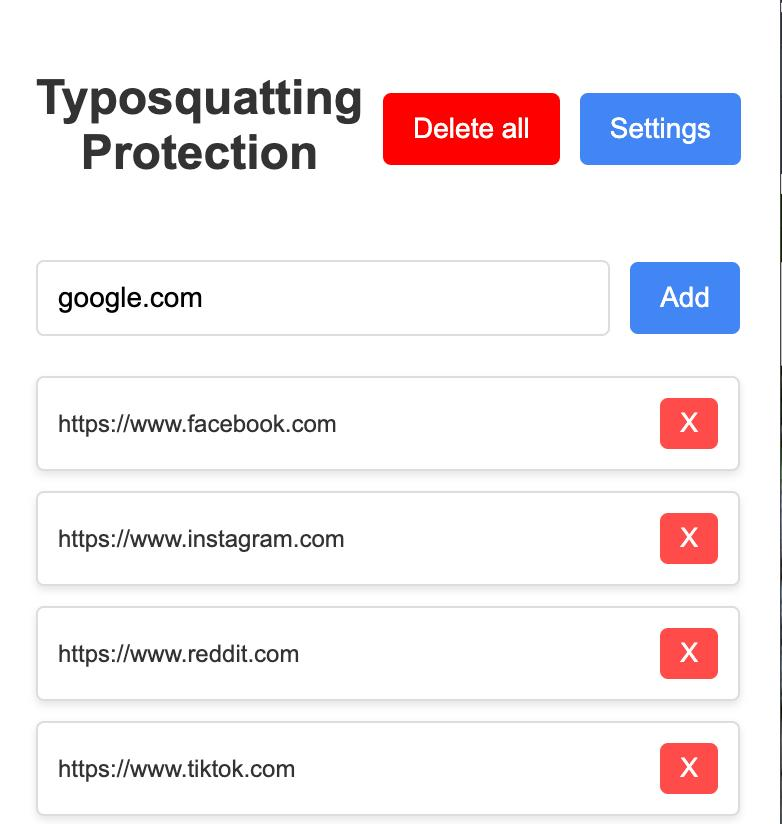

# Typosquatting Protection Extension

Protect yourself from typosquatting attacks with our advanced browser extension. Compatible with all browsers supporting Manifest V3, it ensures you're always on the right track.

## Key Features

- **Safe Browsing**: Automatically verifies URLs to prevent typosquatting and phishing attempts.
- **User-Friendly Interface**: Easy-to-use popup for quick settings and status checks.

## Core Components

The extension consists of three main parts:

- **Background**: The heart of our extension, located at [src/background/background.js](src/background/background.js), constantly monitors and secures your browsing.
- **Popup**: Accessible via the [src/popup](src/popup) directory, the popup window offers control and information at your fingertips.
- **Content Scripts**: The content script is located at [src/content/content.js](src/content/content.js). This script runs in the context of web pages visited by the user.

## Quick Start Guide

1. Clone this repository.
2. Load the extension into your browser by pointing it to the cloned repository.

## Example

## Contributing

Contributions are welcome! 

## License

This project is licensed under the MIT License - see the [LICENSE.md](LICENSE.md) file for details.